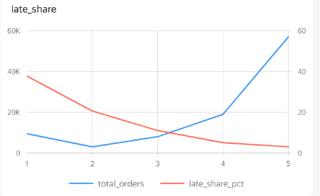
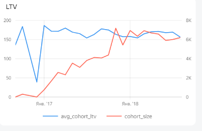
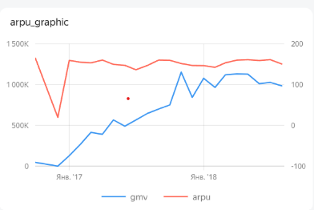
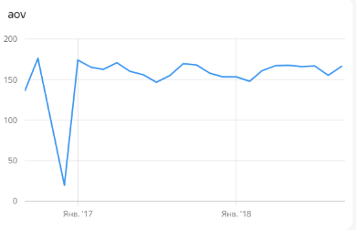
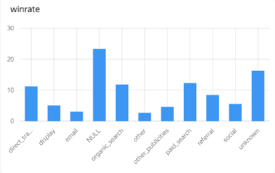

# Olist E-commerce: Product Analysis & Unit Economics

Привет! Это мой аналитический пет-проект, в котором я разобрал данные бразильского маркетплейса Olist. Мне было интересно покопаться в юнит-экономике платформы, посмотреть на поведение когорт и найти узкие места в воронке, из-за которых бизнес теряет деньги и лояльность пользователей. 

**Почему именно эти метрики?**
Когда я только взялся за датасет, был соблазн пойти по легкому пути и посчитать стандартные «ванильные» показатели: средний рейтинг, общую выручку и количество заказов. Но бизнесу нужны не просто красивые цифры на дашборде, а понимание точек роста. Поэтому я сместил фокус на глубокую продуктовую аналитику:
* Вместо *общего CSAT* я пошел искать его первопричину — как именно сбои в логистике убивают лояльность.
* Вместо *сырой выручки* я построил когортный LTV, чтобы оценить реальное качество трафика в моменты жесткого масштабирования маркетинга.
* Вместо *количества заказов* я полез в матрицу удержания (Retention), чтобы проверить жизнеспособность бизнес-модели.

**Стек:** SQL (PostgreSQL) для работы с данными, Yandex DataLens для визуализации.  
**Код:** Все SQL-запросы лежат в папке `sql/`.

---

### Гипотеза: Влияние логистики на оценки (CSAT)
Изначально у меня была гипотеза: я предполагал, что именно задержки курьеров обваливают пользовательскую лояльность. Данные это полностью подтвердили. На графике чётко видно, что доля опоздавших заказов взлетает почти до 40% там, где клиенты ставят «единицу», и падает практически до нуля для пятизвездочных отзывов. Для бизнеса это значит, что главная точка роста лежит не в самом продукте, интерфейсе или скидках, а в банальной оптимизации сроков доставки. Сделаем логистику предсказуемой — автоматически поднимем CSAT.

### Когортный LTV и масштабирование трафика
Здесь я хотел проверить, что происходит с качеством аудитории при резком росте. На графике видно, что в конце 2017 года маркетинг залил огромные бюджеты и привлек рекордные когорты новых пользователей (красная линия). Обычно при таком агрессивном масштабировании качество трафика сильно падает, но здесь синяя линия (средний LTV когорты) осталась на стабильном уровне. Это значит, что маркетологи сработали отлично: они смогли кратно вырастить базу, не нагнав «пустого» и нецелевого трафика.

### Объем продаж (GMV), ARPU и Средний чек
Если смотреть только на общий оборот (GMV), кажется, что всё супер — график уверенно ползет вверх. Но если копнуть глубже в средний чек (AOV) и выручку на пользователя (ARPU), картина меняется. Чек застрял в коридоре 130-170 реалов, а ARPU абсолютно плоский. Это значит, что компания растет исключительно «вширь» за счет новых регистраций. Текущие клиенты не начинают тратить больше с течением времени, что говорит об отсутствии апселла или развития премиум-сегмента.

### Удержание (Retention) и конверсия каналов
Матрица удержания вскрыла главную боль этой юнит-экономики: retention первого месяца болтается на уровне ниже 1%. По сути, бизнес сидит на игле первой покупки и постоянно сжигает деньги на привлечение, ничего не зарабатывая на возвратах. При этом, если посмотреть на конверсию каналов (Winrate), органика приводит самых горячих лидов с конверсией больше 20%, а вот социальные сети работают в минус. Вывод: нужно срочно чинить удержание (например, внедрять программу лояльности) и перекидывать бюджеты из соцсетей в поиск.

